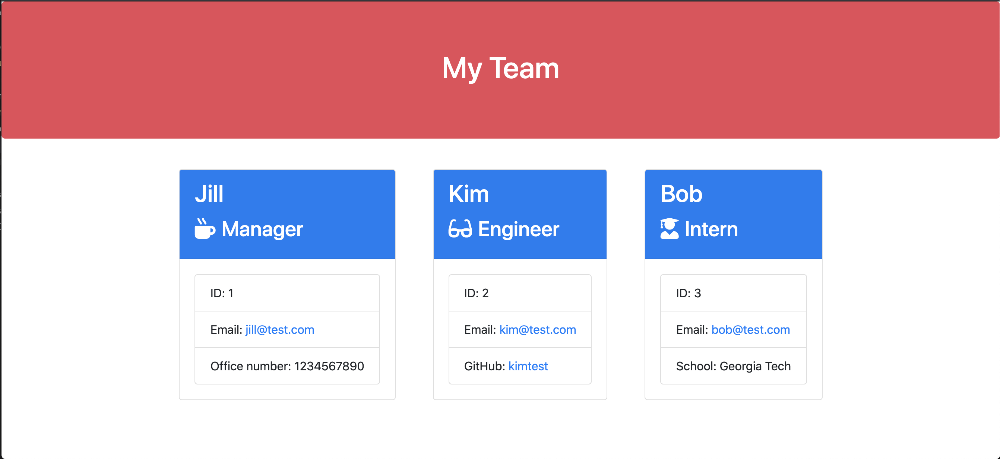

# employee-template-engine

## Summary
In this assignment, we were tasked with creating a command line input program that would take in user input and dynamically create a team profile page. Once repository is cloned, the user must run 'npm install'. This command downloads the required packages (Inquirer and Jest). Once user runs 'node app.js' they will be prompted to answer questions. Once the user has answered the questions for every team member, a HTML page is dynamically populated with the user input.

## Instruction

Navigate to the following Github repository:
    https://github.com/hsaddanathan/employee-template-engine.git

Across the top of the page, click on the Fork button on the right.

Once you have done this, you will see the repo copied within your Github account

Click the Green "Code" Button, and copy repo link. 

Open Terminal and run "git clone (Paste Link Here)"

Once repo has been cloned, you can run " code ." to open in Visual Studio Code. 

From there, open your terminal inside VS Code by using the keyboard shortcut "Ctrl + `. 

Next, type "npm install" to install dependencies.

Once you have done this, type "node app.js" to run the program and answer the prompts.

After the last task, you can navigate to the "Output Directory", select the "team.html", and preview in browser. 

## Technology Used
    * node.js
    * Javascript
    * Inquirer
    * Jest 

## Demo

## Links

employee-template-engine repository link:
    https://github.com/hsaddanathan/employee-template-engine.git

## Contributors 
[@hsaddanathan](https://github.com/hsaddanathan)

*** Tests, HTML Templates, htmlRender code, and package.json were provided by "© 2019 Trilogy Education Services, a 2U, Inc. brand. All Rights Reserved." 

## License
